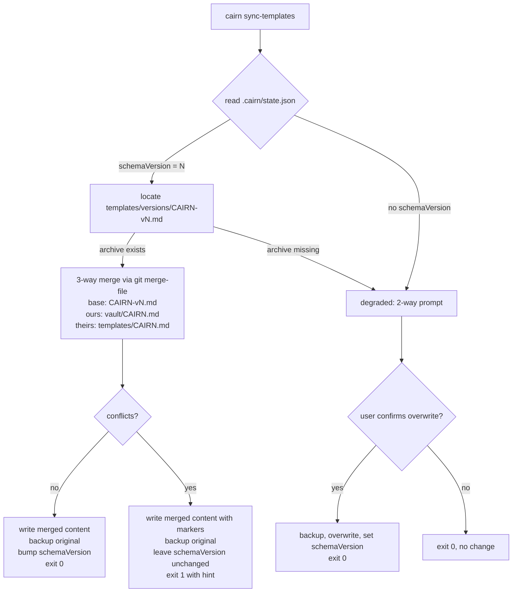

# feat: Template schema versioning and drift reconciliation

## Overview

Add a versioned schema for `templates/CAIRN.md` and a migration path so existing user vaults can reconcile against newer template revisions without losing user edits. Today, `bunx cairn init` is idempotent in the additive sense only — it never rewrites an existing `CAIRN.md`, so vaults silently drift from the plugin's current conventions every release. This plan introduces a `schemaVersion` on every vault, a `templates/versions/` archive, drift detection in `cairn doctor`, and a new `cairn sync-templates` command that performs a 3-way merge (base = archived version, ours = user's current file, theirs = newly shipped template).

## Problem Frame

Cairn ships a schema (`templates/CAIRN.md`) that encodes vault conventions — page types, frontmatter, workflows. The schema evolves (v0.3.0 added page types; v0.5.0 adjusted lint workflow earlier today). The CLI writes `CAIRN.md` once at init and never again. When the plugin bumps the schema, the user's `~/cairn/CAIRN.md` stays pinned to whichever version was installed at init time. Every skill and hook that references CAIRN.md conventions therefore operates on a stale contract for that user.

Confirmed live gap: the current repo owner's `~/cairn/CAIRN.md` is already older than `templates/CAIRN.md` in the repo (verified today via diff). That divergence surfaced organically; a migration path would have caught it automatically.

This plan makes schema evolution a first-class operation instead of an install-time snapshot.

(See origin: `docs/ideation/2026-04-17-open-ideation.md`, idea #1.)

## Requirements Trace

### Persistence & metadata

- R1. Every Cairn vault records the schema version it was installed or last-synced against.
- R5. Vaults with no recorded `schemaVersion` (pre-versioning installs) are handled gracefully — treated as "version unknown" and offered an opt-in sync that treats the current file as user-edited with an empty base.

### Detection & diagnostics

- R2. `cairn doctor` detects drift between the vault's recorded `schemaVersion` and the plugin's current `SCHEMA_VERSION` and reports the gap actionably.

### Reconciliation

- R3. A new `cairn sync-templates` command reconciles the vault's `CAIRN.md` against the newer template without destroying user edits. A backup is written before any mutation. On successful apply, the vault's recorded `schemaVersion` is advanced.
- R4. Historical template versions are bundled with the plugin so a 3-way merge always has a base revision to diff against.

## Scope Boundaries

- Not: introducing runtime schema validation against CAIRN.md (e.g., parsing the template into an enforceable shape). Schema is still prose for the agent to follow; versioning only tracks which prose.
- Not: migrating user wiki pages. This plan migrates `CAIRN.md` only — user-authored pages in `wiki/` are untouched.
- Not: automatic force-apply at SessionStart or during inject. Interactive runs always prompt for confirmation; non-interactive contexts (CI, piped invocations) opt in explicitly via a `--yes` flag on `cairn sync-templates`. The rule is "no silent writes without an explicit consent signal" — either the user said y at a prompt, or they passed `--yes` at the call site.
- Not: cross-version schema translation for frontmatter changes inside existing wiki pages. If a future schema bump changes the required frontmatter shape, a separate migration would handle that — out of scope here.
- Not: decoupling `plugin VERSION` and `SCHEMA_VERSION`. They live side-by-side but evolve independently going forward; this plan introduces `SCHEMA_VERSION` without removing `VERSION`.

### Deferred to Separate Tasks

- SessionStart drift nudge (inject hook reads `schemaVersion`, surfaces "vault is N versions behind; run `cairn sync-templates`"): deferred to a follow-up PR once the sync command is battle-tested. Premature nudging before the fix path is smooth would be annoying.

## Context & Research

### Relevant Code and Patterns

- `src/lib/constants.ts` — exports `VERSION = "0.5.0"`. `SCHEMA_VERSION` joins this file.
- `src/lib/vault.ts` — `scaffoldVault` writes `.cairn/state.json` with `{version, vaultPath, createdAt}` at init. Extend to include `schemaVersion`.
- `src/lib/templates.ts` — `getCairnMdTemplate()` reads `templates/CAIRN.md` at runtime via `readFileSync`. Same pattern applies to archived versions in `templates/versions/CAIRN-v{N}.md`.
- `src/commands/init.ts` — entry point for vault creation. No change needed inside the command itself; the schema version is written via `scaffoldVault`.
- `src/commands/doctor.ts` — reads `state.json`, reports `createdAt`. Extend to read `schemaVersion`, compare to current, surface drift as a warning with a remediation hint.
- `src/cli.ts` — registers subcommands. Add `sync-templates`.
- `tests/init.test.ts` — integration-style tests using `Bun.spawn` on the CLI entry point with a temp vault directory. Mirror this style for sync-templates.

### Institutional Learnings

- No `docs/solutions/` corpus exists yet. The closest prior art is `docs/superpowers/specs/2026-04-15-karpathy-alignment-design.md`, which introduced the current `CAIRN.md` shape — it does not discuss migration, which is exactly the gap this plan fills.

### External References

- `git merge-file` — three-way merge utility, present in any git install. Operates on three files, writes merged output in place with conflict markers on unresolved hunks. Stable CLI, cross-platform.

## Key Technical Decisions

- **New field, not reusing `version`.** The existing `version` field in `.cairn/state.json` records the plugin version at install. Schema evolves independently of plugin version (a patch release could change CAIRN.md; a feature release could leave it alone). Keep both — `version` for plugin provenance, `schemaVersion` for template contract.
- **Integer schema versions, not semver.** `SCHEMA_VERSION` is a monotonically increasing integer (start at `1`). Semver suggests compatibility guarantees we can't make for prose-schema changes. An integer says "this is snapshot N, archived as `templates/versions/CAIRN-v{N}.md`" — nothing more.
- **3-way merge over diff-and-prompt.** Showing the user a two-way diff between their file and the new template forces them to hand-reconcile even when the changes don't conflict. A 3-way merge auto-resolves non-conflicting hunks and only surfaces real conflicts. `git merge-file` does this in one call.
- **Conflicts surface as conflict markers in the written file.** Users resolve in their editor of choice; the command exits non-zero with a hint. We do not build an interactive conflict resolver in the CLI — `git merge-file`'s output is the standard artifact, and editors already handle it.
- **Backup before mutation.** Every run writes `CAIRN.md.bak.{ISO-timestamp}` before touching `CAIRN.md`. Cheap safety net; preserves user's pre-sync state if anything goes wrong.
- **Version archive shipped in the plugin.** `templates/versions/CAIRN-v{N}.md` files live in the repo and are bundled into the plugin install. The 3-way base is always available offline; no network, no git-in-vault requirement.
- **Bumping `SCHEMA_VERSION` is a deliberate release gesture.** When maintainers change `templates/CAIRN.md` in a way they consider a new schema version, they follow this order (order matters — reversing it loses the previous template): (a) copy the existing `templates/CAIRN.md` to `templates/versions/CAIRN-v{current}.md` verbatim, (b) edit `templates/CAIRN.md` with the new schema content, (c) bump `SCHEMA_VERSION` in `src/lib/constants.ts`. This is a three-step checklist item, documented in `templates/versions/README.md`. Not every template edit needs a bump; cosmetic tweaks stay at the current version.

## Open Questions

### Resolved During Planning

- **Where does the `schemaVersion` get persisted?** In `.cairn/state.json` alongside the existing fields — that file is already the vault's control plane.
- **What happens when the user has edited their local `CAIRN.md`?** 3-way merge preserves their edits where they do not conflict with the new template. Conflicts become standard git conflict markers; user resolves in an editor.
- **What happens when no base version is archived (e.g., schema gap)?** Fall back to a 2-way "you must resolve manually" path: show a plain diff, prompt for overwrite-or-abort, and require explicit confirmation. This only fires for orphaned vaults whose recorded version has no archive on disk — treat as degraded mode.
- **What happens when the vault has no `schemaVersion` at all?** Treat as "version unknown." Offer the sync with an empty base (equivalent to 2-way merge: user's file vs current template), require explicit confirmation, write `schemaVersion` on apply.

### Deferred to Implementation

- **Exact `git merge-file` invocation and how to detect conflict-vs-clean exit codes.** Known interface but best confirmed against the local binary during implementation.
- **Interactive prompt library.** `citty` is already in use for command defs; whether to use its prompt helpers or shell out to plain `readline` is a small decision made at implementation time.
- **Whether to expose `--force` / `--no-backup` flags.** Decide during implementation based on UX feel; starting conservative (no flags, always backup, always prompt).

## High-Level Technical Design

> *This illustrates the intended approach and is directional guidance for review, not implementation specification. The implementing agent should treat it as context, not code to reproduce.*



Decision matrix for sync outcomes:

| Vault state | Archive present | User edits | Outcome |
|-------------|-----------------|------------|---------|
| `schemaVersion = current` | n/a | n/a | no-op, report "up to date" |
| `schemaVersion = N < current` | yes | none | clean merge; apply, bump version |
| `schemaVersion = N < current` | yes | non-conflicting | clean merge; apply, bump version |
| `schemaVersion = N < current` | yes | conflicting | write with conflict markers; leave version; exit 1 |
| `schemaVersion = N < current` | no | any | degraded: 2-way prompt |
| no `schemaVersion` | n/a | any | degraded: 2-way prompt; set version on apply |

## Implementation Units

- [ ] **Unit 1: Introduce `SCHEMA_VERSION` and persist it at init**

**Goal:** Track the vault's schema version in `.cairn/state.json` from install forward. All new vaults created after this lands carry a `schemaVersion`; older vaults are handled by Unit 3's degraded-mode path.

**Requirements:** R1

**Dependencies:** None

**Files:**
- Modify: `src/lib/constants.ts` (add `SCHEMA_VERSION` integer constant, starting at `1`)
- Modify: `src/lib/vault.ts` (`scaffoldVault` writes `schemaVersion` into `state.json`)
- Modify: `tests/init.test.ts` (extend assertions to check `schemaVersion`)
- Modify: `templates/CAIRN.md` (no content change; document the `schemaVersion` convention in a short `## Schema Version` subsection so the field has a home in human-readable form too — optional but cheap)

**Approach:**
- Add `SCHEMA_VERSION` to `src/lib/constants.ts` next to `VERSION`. Integer, starts at `1`.
- In `scaffoldVault`, include `schemaVersion: SCHEMA_VERSION` in the JSON object written to `.cairn/state.json`. All three existing fields (`version`, `vaultPath`, `createdAt`) remain.
- Keep the `STATE_FILE` path and shape otherwise unchanged.

**Patterns to follow:**
- Existing `VERSION` constant in `src/lib/constants.ts`.
- Existing `state.json` write in `src/lib/vault.ts:83-94`.

**Test scenarios:**
- Happy path: `cairn init --vault-path <tmp>` produces a `state.json` containing `schemaVersion: 1`.
- Edge case: `cairn init` run twice on the same path still leaves `schemaVersion` intact (idempotent).

**Verification:**
- `bun test` passes, including new assertion.
- A freshly initialized vault's `state.json` contains all four fields.

---

- [ ] **Unit 2: Archive the v1 template**

**Goal:** Establish the `templates/versions/` archive and bundle the current CAIRN.md as the v1 base for future 3-way merges.

**Requirements:** R4

**Dependencies:** Unit 1 (establishes the versioning convention this unit materializes)

**Files:**
- Create: `templates/versions/CAIRN-v1.md` (copy of `templates/CAIRN.md` at the moment `SCHEMA_VERSION = 1` becomes canonical)
- Create: `templates/versions/README.md` (short note: archival convention, "when to add a new version" checklist)
- Modify: `src/lib/templates.ts` (add `getArchivedCairnMdTemplate(version: number): string | null`, mirroring `getCairnMdTemplate` but reading from `templates/versions/`)

**Approach:**
- Duplicate the current `templates/CAIRN.md` as `templates/versions/CAIRN-v1.md`. Exact byte copy.
- Add a helper in `src/lib/templates.ts` that resolves `templates/versions/CAIRN-v{N}.md` for a given integer version, returning `null` when the file is absent.
- Document the bump checklist: when a future schema change lands, the previous `templates/CAIRN.md` is copied here under the next version number before `SCHEMA_VERSION` is incremented.

**Patterns to follow:**
- `getCairnMdTemplate` in `src/lib/templates.ts` for the file-read pattern.

**Test scenarios:**
- Happy path: calling the helper with version `1` returns the archived file contents.
- Edge case: calling with a missing version (`99`) returns `null` without throwing.

**Verification:**
- `templates/versions/CAIRN-v1.md` exists and matches `templates/CAIRN.md` at the time of commit.
- Helper returns string for v1 and `null` for absent versions.

---

- [ ] **Unit 3: Drift detection in `cairn doctor`**

**Goal:** `cairn doctor` surfaces schema drift as a warning with a remediation hint pointing at `cairn sync-templates`. Vaults without a `schemaVersion` get a distinct "version unknown" warning.

**Requirements:** R2, R5

**Dependencies:** Unit 1 (drift detection depends on the field being written)

**Files:**
- Modify: `src/commands/doctor.ts` (extend the `Vault` section to read and compare `schemaVersion`)
- Modify: `tests/doctor.test.ts` (create if absent; follow `tests/init.test.ts` spawn pattern)

**Approach:**
- After the existing `state.json readable` check, read `parsed.schemaVersion` and compare to `SCHEMA_VERSION` from constants.
- Emit one of three lines:
  - `ok` — `schemaVersion matches current (v{N})`
  - `warn` — `schemaVersion v{vault} behind current v{current} — run 'cairn sync-templates'`
  - `warn` — `schemaVersion unknown — pre-versioning vault; run 'cairn sync-templates' to reconcile`
- Do not treat drift as an `error` — vaults still work; drift is actionable but not blocking.

**Patterns to follow:**
- Existing `line(status, label, detail)` helper in `src/commands/doctor.ts:17`.
- Existing `warnings` counter increment pattern.

**Test scenarios:**
- Happy path: a fresh vault with matching `schemaVersion` reports `ok schemaVersion matches current`.
- Edge case: a vault with `schemaVersion: 0` (or any integer less than current) reports the `warn` drift line and increments warnings.
- Edge case: a vault whose `state.json` has no `schemaVersion` key reports the "unknown" warn line.
- Error path: an unreadable `state.json` still produces the existing error path (no regression).

**Verification:**
- `cairn doctor` run against a synthetic vault with each of the three states produces the expected line.
- Warning count reflects drift when present.

---

- [ ] **Unit 4: `cairn sync-templates` command**

**Goal:** Implement the reconciliation command. Reads vault `CAIRN.md`, archived base, shipped template; runs 3-way merge via `git merge-file`; backs up the original; writes the merged result; advances `schemaVersion` on clean apply.

**Requirements:** R3, R5

**Dependencies:** Units 1, 2 (needs the field and the archive)

**Files:**
- Create: `src/commands/sync-templates.ts`
- Modify: `src/cli.ts` (register the subcommand alongside `init`, `doctor`, `uninstall`)
- Create: `tests/sync-templates.test.ts`

**Approach:**
- New citty `defineCommand` mirroring `src/commands/doctor.ts` shape.
- Args: `--vault-path` (optional; default via `resolveVaultPath(process.cwd())`), `--yes` (optional; skip confirmation prompts — useful for non-interactive contexts like CI or pipe runs).
- Flow:
  1. Resolve vault path; verify it is a Cairn vault (`checkVaultState`).
  2. Read `state.json`. Extract `schemaVersion` (may be undefined).
  3. If `schemaVersion === SCHEMA_VERSION`: print "already current" and exit 0.
  4. Locate base: `getArchivedCairnMdTemplate(schemaVersion)`. If null (or version unknown), enter degraded 2-way path.
  5. 3-way path: shell out to `git merge-file -p <ours> <base> <theirs>` to write to stdout; capture output and exit code. Non-zero exit code indicates conflicts.
  6. Show a diff preview to the user (use `git diff --no-index` or a simple line-level diff fallback). Prompt y/n unless `--yes`.
  7. On confirm: backup vault's current `CAIRN.md` to `CAIRN.md.bak.<ISO-timestamp>`, then write merged output to `CAIRN.md`. If no conflicts, update `state.json` `schemaVersion` to current. If conflicts present, leave `schemaVersion` unchanged and exit 1 with a hint to resolve markers and re-run.
  8. State.json update uses read-modify-write semantics: read the existing JSON, mutate only `schemaVersion` (and any other fields this command owns), preserve every other key. Never rewrite state.json from an object literal — that would drop fields added by future plugin releases the user has running concurrently, and would overwrite the `version` field this plan intentionally keeps decoupled from `schemaVersion`.
  9. Degraded 2-way path: if no archive exists or `schemaVersion` is unknown, present the shipped template as a plain diff against current; prompt overwrite. Treat confirmation as "user accepts the shipped version wholesale"; set `schemaVersion` on apply.
- All writes via `writeFileSync` to follow existing conventions in `src/lib/vault.ts`.

**Execution note:** Start with the tests: stand up a synthetic vault fixture directory in a temp path with a known-older `CAIRN.md`, a bundled `templates/versions/CAIRN-v1.md`, and a newer `templates/CAIRN.md`; drive the CLI via `Bun.spawn`. The three-way logic is tricky enough that test-first forces the decision matrix (Unit 1, 2, 3 cells from the decision matrix above) to be explicit up front.

**Technical design:** *(directional, not implementation)*

Command skeleton shape — illustrates the decision points, not the code:

```
readState → resolveBase → runMerge → showDiff → promptConfirm → writeBackup → applyMerge → updateState
                 ↘ (null)
                   degradedPrompt → writeBackup → overwrite → updateState
```

Exit codes:
- `0` — no-op (already current), clean apply, or user declined
- `1` — merge completed with conflicts needing manual resolution, or vault-not-cairn error

**Patterns to follow:**
- `src/commands/doctor.ts` for citty command shape and vault path resolution.
- `src/commands/init.ts` for console output style (created/skipped summary).
- `tests/init.test.ts` for `Bun.spawn` test pattern with temp vault directories.

**Test scenarios:**
- Happy path — already current: vault at `schemaVersion: 1`, current `SCHEMA_VERSION = 1`, command prints "already current" and exits 0 with no file changes.
- Happy path — clean 3-way merge: vault at `schemaVersion: 1` with unmodified CAIRN.md, shipped template has a non-conflicting addition; command produces merged file, backup written, `schemaVersion` advanced, exit 0.
- Happy path — clean 3-way merge with user edits: vault at `schemaVersion: 1` with user additions that do not overlap the shipped template's changes; both sets of changes preserved in merged output, exit 0.
- Error path — conflicting merge: vault at `schemaVersion: 1` with user edits to a section the shipped template also changed; merged file contains conflict markers (`<<<<<<<`, `=======`, `>>>>>>>`), `schemaVersion` unchanged, exit 1 with a remediation hint in stdout.
- Edge case — archive missing: vault records `schemaVersion: 99` (fictitious) so no archive file exists; command enters degraded 2-way path and prompts.
- Edge case — schemaVersion absent: vault `state.json` lacks the field entirely; command enters degraded 2-way path and sets `schemaVersion` on apply.
- Edge case — user declines: `--yes` not passed; prompt responds `n`; command exits 0 with no writes (backup also skipped).
- Edge case — backup preserves byte-for-byte copy: after apply, `CAIRN.md.bak.<ts>` matches the pre-merge content exactly.
- Error path — not a Cairn vault: command invoked in a directory with no `.cairn/state.json`; exits 1 with the same error pattern `cairn init` uses for occupied directories.
- Integration: with `--yes`, the full pipe completes without TTY interaction and exit codes match expectations in each of the above scenarios.

**Verification:**
- `bun test` passes all sync-templates scenarios.
- `bun run lint` clean.
- Manual smoke: run against a real stale vault (e.g., the dev's `~/cairn`) and observe the merge.

## System-Wide Impact

- **Interaction graph:** `init` writes `schemaVersion` into `state.json`. `doctor` reads it. `sync-templates` reads and writes it. No hooks read it yet (deferred-nudge unit).
- **Error propagation:** `sync-templates` exits non-zero only on explicit error states (not-a-vault) or unresolved merge conflicts. User-declined operations exit 0. Matches `doctor` convention (warnings do not exit non-zero; only errors do).
- **State lifecycle risks:** If `sync-templates` crashes between backup write and `CAIRN.md` overwrite, the user has a backup and a pristine original. If it crashes between `CAIRN.md` write and `state.json` advance, the next run re-applies — idempotent against already-merged content (`git merge-file` on identical files is a no-op, but the backup churn is real). Mitigation: check for byte-equivalence before write to suppress the backup on no-ops.
- **API surface parity:** `doctor`, `init`, and `sync-templates` all read from the same `state.json` shape — keep the field list consistent across all three callers. The `STATE_FILE` constant and writer in `src/lib/vault.ts` remain the single source of truth.
- **Integration coverage:** the `Bun.spawn` integration tests in `tests/sync-templates.test.ts` are the primary proof that the decision matrix resolves correctly end-to-end. Unit tests alone on the merge helper would miss the state.json and file system coordination.
- **Unchanged invariants:** `bunx cairn init` behavior is unchanged for a fresh directory (no new prompts, no new required flags). `doctor` exit-on-error behavior unchanged (schema drift is a warning, not an error). `templates/CAIRN.md` content unchanged by this plan — only archived.

## Risks & Dependencies

| Risk | Mitigation |
|------|------------|
| `git merge-file` not available on the user's machine | Cairn users run `bunx`, which requires Node/Bun; git is a near-universal dependency in this population, but detect missing `git` at sync time and fall back to the degraded 2-way prompt. Surface a one-line note in `doctor` when git is absent so users understand the capability. |
| Maintainers forget to archive the previous `templates/CAIRN.md` before bumping `SCHEMA_VERSION` | Add the bump checklist to `templates/versions/README.md`. Consider a future CI check that verifies every integer from `1..SCHEMA_VERSION` has a corresponding `CAIRN-v{N}.md` — out of scope for this plan but noted. |
| Conflict-marker output confuses non-git users | Print a clear hint on exit 1: "Conflicts written to CAIRN.md. Resolve markers (`<<<<<<<`, `=======`, `>>>>>>>`) in your editor, then re-run `cairn sync-templates` to finalize." |
| User runs `sync-templates` accidentally on a customized vault and overwrites their hand-written CAIRN.md | Always backup; always prompt unless `--yes`; diff preview shown before confirm. Backup filename uses ISO timestamp so multiple runs do not clobber each other. |
| Schema bump where conflict-free merge produces a semantically broken vault (e.g., a section renamed the user depended on) | Out of technical scope — this is a release-quality concern for whoever bumps `SCHEMA_VERSION`. Maintainers should note breaking changes in a CHANGELOG entry; `sync-templates` output includes the version span ("reconciling v1 → v2") so users know to read release notes. |

## Documentation / Operational Notes

- Update `README.md` install section: add a short note about `cairn sync-templates` for existing users when a plugin upgrade ships a schema bump. Keep it terse — one paragraph under the existing install block.
- Add a `## Schema Versioning` subsection to `README.md` or a separate `docs/schema.md` explaining the versioning convention (integer `SCHEMA_VERSION`, archive in `templates/versions/`, maintainer bump checklist). Decide at implementation time which file hosts it.
- No migration for the current repo's archived v1 file — the shipping `templates/CAIRN.md` at release time becomes v1.
- No telemetry added.

## Sources & References

- **Origin:** `docs/ideation/2026-04-17-open-ideation.md` (idea #1: Schema migration & template drift reconciliation)
- Related files: `src/lib/constants.ts`, `src/lib/vault.ts`, `src/lib/templates.ts`, `src/commands/init.ts`, `src/commands/doctor.ts`, `src/cli.ts`
- Related tests: `tests/init.test.ts`
- Prior schema change context: `docs/superpowers/specs/2026-04-15-karpathy-alignment-design.md`, `docs/superpowers/plans/2026-04-15-v0.3.0-wiki-improvements.md`
