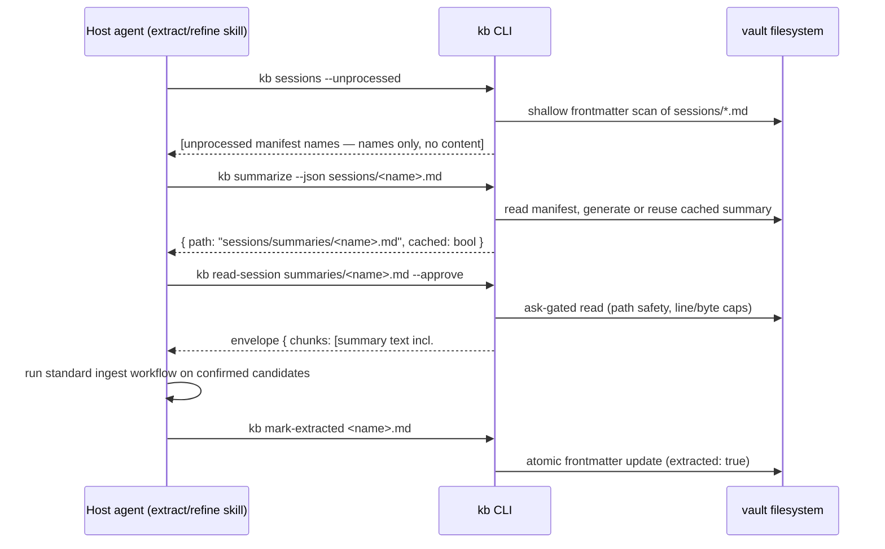

# fix: Align code and shipped docs with the stated goal

## Summary

`kb`'s stated goal — the behavior promised by README.md, templates/KB.md, commands/*.md, skills/*, and hooks/ — has drifted from the code. A full repo audit (2026-06-11) found the code healthy (215/215 tests green, `tsc --noEmit` clean) but the docs wrong in places, internally contradictory in others, and one documented feature (`autoExtractNudge`) entirely unimplemented. This plan closes the gap in both directions: docs move to match tested, working code; code moves to match docs where the docs express clear product intent (the extract nudge, a sanctioned way to mark manifests extracted).

Deliverable: one PR containing six dependency-ordered units, each landable as an atomic commit, verified by `bun test` and `bunx tsc --noEmit`.

---

## Problem Frame

The project's README and shipped agent-facing docs are the spec users and host agents act on. Today they:

1. **Claim behavior the code doesn't have** — README says `kb init` "registers hooks in Claude Code" and `kb uninstall` "removes hooks"; both commands only print plugin instructions (`src/commands/init.ts`, `src/commands/uninstall.ts`).
2. **Document a non-default mode as the only mode** — README describes eager injection only, but fresh installs default to `lazy` (`src/lib/vault.ts`), so the out-of-box experience contradicts README's opening bullet.
3. **Contradict the trust boundary they ship next to** — `commands/query.md` tells the agent to Grep `sessions/*.md`, which the shipped deny rules block; `skills/refine/SKILL.md` tells the agent to Read `sessions/summaries/`, also denied; `skills/extract/SKILL.md` describes finding `## Extraction Candidates` in manifest bodies, which are empty by construction (`src/lib/manifest.ts`). `tests/skill-contract.test.ts` pins this stale text, actively enforcing the drift.
4. **Promise a feature with no delivery mechanism** — the `/kb:extract on|off` session-start nudge writes `autoExtractNudge` to `.kb/state.json`, but nothing in `src/` reads it.
5. **Carry residue from removed/renamed subsystems** — "migration quarantine" wording for `.trash/` (migrate-sessions was deleted in `7cfc6fc`), dead exports (`withMigrationLock`, unused `entire.ts` wrappers, orphan `emitEnvelope` re-export), and a wikilink canonical form mandated in `templates/KB.md` but not propagated to `skills/kb/SKILL.md` or the stubs in `src/lib/templates.ts`.
6. **Hide half the product** — the trust-boundary retrieval surface (`recall`, `get`, `list-topics`, `read-raw`, `read-session`, envelopes, ask-gating) is the project's core safety feature and is invisible in README.

---

## Assumptions

Headless planning run; these inferred decisions would normally be confirmed interactively:

- **"Stated goal" = the shipped documentation contract** (README, templates, commands, skills, hooks), not the untracked 2026-05-08 repositioning plan (`docs/plans/2026-05-08-001-feat-llm-tree-navigation-and-sessions-offload-plan.md`). That plan is a large unimplemented feature direction (tree navigation, Entire session offload) and is explicitly out of scope here.
- **Docs move toward code by default** — the code is tested and recently hardened (trust boundary, lazy retrieval); the docs lag it. Exceptions where code moves toward docs: the extract nudge (R7) and a sanctioned `extracted` marker (R6), because the docs express clear product intent and the extract workflow is otherwise unusable as documented.
- **The lazy inject default is intentional** (it landed with the trust-boundary work, PR #2), so README documents lazy-as-default rather than reverting the default to eager.
- **`commands/query.md`'s "query sessions by files touched" section is dropped**, not replaced with a new `kb sessions --touching` command — no demonstrated demand, and the May-08 direction moves sessions out of kb entirely. Deferred to follow-up work.

---

## Requirements

- **R1** — README accurately describes install/uninstall: `kb init` scaffolds the vault only; hooks come from the Claude Code plugin; `kb uninstall` prints plugin-removal instructions and preserves the vault.
- **R2** — README documents both inject modes, the lazy default for fresh installs, and resolution order (`KB_INJECT_MODE` env → `.kb/config.json` → default), plus `KB_VAULT`.
- **R3** — README documents the full registered CLI surface and the trust-boundary model (curated vs untrusted tiers, envelopes, ask-gating).
- **R4** — Vault-structure docs include `.kb/` operational state and describe `.trash/` correctly (summary-replacement quarantine, not "migration quarantine") in all three places it appears (README.md, templates/KB.md, skills/kb/SKILL.md).
- **R5** — Extract, refine, and query docs use one coherent summary-retrieval mechanism compatible with the shipped deny rules; `tests/skill-contract.test.ts` is updated in the same commit so it enforces the new text.
- **R6** — The agent has a sanctioned, deny-rule-compatible way to mark a session manifest as extracted (new `kb mark-extracted` subcommand) and to enumerate unprocessed manifests by name (`kb sessions --unprocessed`), since direct Read/Glob/Edit of `sessions/**` is blocked and the documented extract flow cannot start without enumeration.
- **R7** — The `autoExtractNudge` toggle does something: when enabled and unprocessed manifests exist, the inject hook surfaces a one-line nudge in both lazy and eager modes. Hook stays LLM-free and fail-soft.
- **R8** — Wikilink canonical form `[[kebab-filename|Display Title]]` is consistent across `templates/KB.md`, `skills/kb/SKILL.md`, `skills/extract/SKILL.md`, and the stubs in `src/lib/templates.ts`; `LOG_MD_STUB` includes the `refine` log type.
- **R9** — Dead code removed (`withMigrationLock`, unused `entire.ts` exports, orphan `emitEnvelope` re-export); `kb doctor`'s "newest wiki page" staleness check measures `wiki/` only; `src/commands/init.ts` prints the correct plugin-install command; `src/hooks/inject.ts` reports the actual hook event name.
- **R10** — `bun test` and `bunx tsc --noEmit` green after every unit.

---

## Key Technical Decisions

- **Doc+code+test land in lockstep per unit.** `tests/docs-contract.test.ts` and `tests/skill-contract.test.ts` assert literal doc substrings. Any unit touching pinned text updates the test in the same commit — the established pattern from `7cfc6fc` (migrate-sessions removal touched command, lib, tests, doctor, constants, and README atomically).
- **Canonical summary-retrieval path: `kb summarize --json <manifest>` to ensure the cached summary exists, then `kb read-session summaries/<name>.md --approve` to retrieve it.** Rationale: `summarize` already creates/returns cached summaries; `read-session` already permits subpaths via `assertSafeFilename` and returns an ask-gated envelope; no new retrieval primitive needed. This replaces three contradictory stories (README/commands say summarize-then-read-path, extract skill says read manifest body, refine skill says Read the path directly — the latter two are broken under deny rules).
- **`kb mark-extracted <filename>` as a thin subcommand** following the existing command shape (citty wrapper in `src/commands/`, logic in `src/lib/`, path safety via `assertSafeFilename`, atomic write, access-log entry with the existing hashed-query convention). Alternative rejected: telling the agent to Edit frontmatter directly — impossible, Read of `sessions/**` is denied and Edit requires a prior Read.
- **Nudge implementation lives in the inject path, computed kb-side.** The hook (not the agent) counts manifests with `extracted: false` when `.kb/state.json` has `autoExtractNudge` enabled, appending one line to the pointer (lazy) or after sessions content (eager). No LLM call, no new env vars, bounded cost (frontmatter-only scan of `sessions/*.md`). Failure to read state or sessions silently skips the nudge — hooks never fail the session. Alternative rejected: retracting the toggle from the docs (the default docs-toward-code direction) — the toggle shipped in user-facing docs, the underlying need is real (sessions accumulate silently in lazy mode), and a one-line hook nudge is the cheapest delivery that honors it.
- **Dead-code removal is deletion, not preservation.** `withMigrationLock` (orphaned by `7cfc6fc`), `explainCheckpoint`/`explainCheckpointFull` (zero importers), and the `emitEnvelope` re-export in `sensitive-read.ts` (comment references a former consumer that no longer exists) all go. `isEntireEnabled` is removed too unless implementation finds a live doc/skill reference to kb-side Entire detection (the extract skill shells out to `entire` directly; verify before deleting).

---

## High-Level Technical Design

Canonical extraction retrieval flow after this plan (replaces the three contradictory documented flows):

The nudge (R7) is a read-only branch in the existing inject flow: resolve mode → if `autoExtractNudge` enabled, count `sessions/*.md` with `extracted != true` → if N > 0, append one line (`N unprocessed session manifest(s) — run /kb:extract`) to the emitted context. Prose above is authoritative if the diagram and text disagree.

---

## Scope Boundaries

- Not implementing the 2026-05-08 tree-navigation/sessions-offload plan or any part of the agent-neutral repositioning.
- Not changing the inject default (`lazy` stays the fresh-install default).
- Not changing the envelope wire format, trust-boundary semantics, or deny rules.
- Not adding session content-search/query commands (`kb sessions --touching` etc.). A names-only unprocessed-manifest listing (U2) ships because the documented extract flow cannot start without enumeration; content search stays out.
- Not restructuring README beyond accuracy — no marketing rewrite.

### Deferred to Follow-Up Work

- `kb sessions --touching <path>` (or equivalent) if manifest-field queries prove needed after `commands/query.md`'s sessions section is dropped.
- A `docs/solutions/` learning entry on doc-drift prevention and the contract-test convention (`/ce-compound` candidate after this PR lands, per the existing workflow learning).
- Stating the Bun hard requirement more prominently / supporting node — README gets a one-line requirement note in U1; anything more is out of scope.

---

## Implementation Units

### U1. README accuracy pass

- **Goal**: README matches what the code actually does.
- **Requirements**: R1, R2, R3, R4 (README portion).
- **Dependencies**: none for the accuracy fixes; the CLI-table rows for `mark-extracted` and `sessions` land with U2's commit so the README never documents a command that doesn't exist yet.
- **Files**: `README.md`; verify `tests/docs-contract.test.ts` still passes (update only if it pins changed strings).
- **Approach**: Fix install claim (init scaffolds; plugin registers hooks) and uninstall claim (prints instructions; vault preserved). Document inject modes: lazy default on fresh installs, eager behavior and 32KB budget, resolution order `KB_INJECT_MODE` → `.kb/config.json` `inject_mode` → `eager` for pre-existing vaults. Add a CLI reference table covering all registered subcommands (`init`, `doctor`, `uninstall`, `recall`, `get`, `list-topics`, `read-raw`, `read-session`, `capture-session`, `summarize`, `summaries`, plus `mark-extracted` and `sessions` from U2). Add a short trust-boundary section (curated vs untrusted tiers, envelope output, ask-gated reads, security self-test). Document `KB_VAULT` and `KB_INJECT_MODE` alongside existing `KB_BUDGET`/`KB_SUMMARIZE_COMMAND`. Add `.kb/` to the vault-structure tree; reword `.trash/` to summary-replacement quarantine. Note the Bun runtime requirement once near Install.
- **Patterns to follow**: existing README section voice (terse, imperative); doc-fix commits `f94636c`, `b48dc0f`.
- **Test scenarios**: Test expectation: none — docs-only unit; gate is `bun test` staying green (docs-contract assertions) plus a manual cross-check of each claim against the source file cited in the audit.
- **Verification**: every README claim about commands, env vars, defaults, and vault layout can be pointed at a specific source location; the CLI reference table matches the subcommands registered in `src/cli.ts`; `bun test` green.

### U2. `kb mark-extracted` and unprocessed-session listing

- **Goal**: sanctioned, deny-rule-compatible session-state surface — flip `extracted: true` on a manifest, and enumerate unprocessed manifests by name. These are the two operations the documented extract workflow needs that the deny rules otherwise block.
- **Requirements**: R6, R10.
- **Dependencies**: none (lands before U3, which documents it).
- **Files**: `src/commands/mark-extracted.ts` (new), `src/commands/sessions.ts` (new, names-only listing), `src/cli.ts` (register both), `src/lib/manifest.ts` (frontmatter update helper if not extractable from existing code), `src/lib/access-log.ts` (new write-audit entry shape + extend the command union), `tests/mark-extracted.test.ts` (new), `tests/sessions-list.test.ts` (new).
- **Approach**: citty wrappers delegating to lib code, matching the existing command shape. `mark-extracted`: validate the filename with `assertSafeFilename` (manifests only — reject `summaries/` subpaths), parse frontmatter with `parseFrontmatter` from `src/lib/frontmatter.ts` — fail-hard; there is no tolerant-YAML parser in the current tree (the one patched in `5cdea88` was deleted with migrate-sessions) — on parse error exit nonzero without writing; set `extracted: true`, write atomically (tmp + rename, the `capture-session.ts` pattern). `sessions --unprocessed`: shallow scan of `sessions/*.md` frontmatter (skip `summaries/`, `.trash/`, subdirectories), print manifest filenames with `extracted != true` — names only, never content. Logging: `mark-extracted` is a write, so define a small write-audit entry shape (timestamp, command, hashed target, exit status) rather than forcing the read-centric `AccessLogEntry` fields (`query_hash`/`pages_returned`/`bytes_returned`); extend the `AccessLogCommand` union in the same commit so `tsc` enforces the new tag. Exit nonzero with a clear message on missing file.
- **Execution note**: implement test-first; this is the only new feature-bearing command surface.
- **Test scenarios**:
  - Happy path: manifest with `extracted: false` → command exits 0, frontmatter shows `extracted: true`, body untouched.
  - Idempotent: already-`extracted: true` manifest → exits 0, no data loss (byte-identical output not required — YAML re-serialization may reorder keys; assert all field values survive).
  - Missing file: nonexistent manifest name → nonzero exit, message names the file, no file created.
  - Path safety: `../escape.md` and `summaries/foo.md` rejected with nonzero exit.
  - Malformed YAML: manifest with broken frontmatter → nonzero exit, file not modified (fail-hard parser; no repair attempt).
  - Access log: successful `mark-extracted` appends an entry whose command field is exactly `mark-extracted` (not any existing read tag), hashed target, no plaintext filename leakage beyond the existing convention.
  - Listing: vault with 2 unprocessed manifests + 1 extracted + 1 file under `summaries/` → `sessions --unprocessed` prints exactly the 2 manifest names and nothing from `summaries/` or `.trash/`.
- **Verification**: `bun test` green including new files; `bunx tsc --noEmit` clean.

### U3. Reconcile extraction/refine/query retrieval docs

- **Goal**: one coherent, deny-rule-compatible retrieval story across all agent-facing docs; contract test enforces the new text.
- **Requirements**: R5, R4 (skill/template `.trash` wording).
- **Dependencies**: U2 (docs reference `kb mark-extracted` and `kb sessions --unprocessed`).
- **Files**: `skills/extract/SKILL.md`, `skills/refine/SKILL.md`, `commands/extract.md`, `commands/query.md`, `templates/KB.md` (`.trash` wording), `skills/kb/SKILL.md` (`.trash` wording), `README.md` (extract section if U1 left the old mechanism), `tests/skill-contract.test.ts`.
- **Approach**: rewrite the extract skill workflow to the canonical path (enumerate via `kb sessions --unprocessed` → `kb summarize --json` → `kb read-session summaries/<name>.md --approve` → ingest → `kb mark-extracted`) — the enumeration step replaces "ask the user for filenames", which had no sanctioned answer under the deny rules. Remove the claim that candidates are visible in manifest chunk text. Fix refine skill step that directs a raw Read of `sessions/summaries/` to use `kb read-session summaries/<name>.md --approve`, consistent with refine's own rule 7. Drop `commands/query.md`'s "query sessions by files touched" section (deny rules make it dead on arrival). Document the summarizer prerequisite where the flow is taught (extract skill + README extract section): `kb summarize` shells out to `claude -p --model haiku` or `KB_SUMMARIZE_COMMAND`, and when neither is available it exits nonzero and extraction cannot proceed — the docs name this failure mode instead of implying a self-contained flow. All documented invocations use the `kb` binary with vault-relative filenames (the shipped `Bash(bun* *kb/sessions/*)` deny pattern can match `bunx`-style invocations carrying session paths). The `/kb:extract on|off` toggle keeps writing `.kb/state.json` directly (host-controlled operational state, not vault content); U4's reader-side hardening makes that safe. Update `tests/skill-contract.test.ts` assertions in the same commit to pin the *new* wording — the test currently enforces the stale text.
- **Test scenarios**:
  - `tests/skill-contract.test.ts` updated assertions: extract skill contains the enumerate → summarize → read-session sequence and `kb mark-extracted`; extract skill names the summarizer prerequisite; refine skill no longer instructs direct Reads under `sessions/`; query command no longer references Grep over `sessions/*.md`.
  - Negative pins: assert the stale phrases ("Extraction Candidates section ... visible in the chunk text", "read the returned `path` under `sessions/summaries/`", "files_changed") are absent from their respective docs.
- **Verification**: `bun test` green; a manual dry-run of the documented extract flow against a scratch vault succeeds under the shipped deny rules (no denied tool calls required by the docs).

### U4. Implement the `autoExtractNudge`

- **Goal**: the documented `/kb:extract on|off` toggle has an effect — session start surfaces unprocessed-manifest count.
- **Requirements**: R7, R10.
- **Dependencies**: U2 (the `extracted` field is the counting key; the scan reuses U2's unprocessed-listing helper; mark-extracted is how counts go down).
- **Files**: `src/hooks/inject.ts`, `src/lib/inject/pointer.ts`, `src/lib/inject/eager.ts`, the U2 listing helper in `src/lib/` (state read + manifest count), `tests/inject.test.ts` / `tests/inject-modes.test.ts`.
- **Approach**: after mode resolution, read `.kb/state.json` and act only when it parses and `autoExtractNudge === true` (strict boolean check; unrecognized keys ignored — the file is agent-editable, so the reader validates rather than trusts). The scan is shallow `sessions/*.md` frontmatter only (skip `summaries/`, `.trash/`, subdirectories), reusing U2's listing helper, and guarded by the existing path-safety pattern — `assertGenuineScopeDir` on `sessions/` and `O_NOFOLLOW` per-file reads (both already exist in `src/lib/path-safety.ts` / `sensitive-read.ts`) — so a symlinked sessions dir or manifest is skipped, not followed. The nudge line is built kb-side from the count alone: validate N is a finite non-negative integer before interpolation and emit a single newline-free line; manifest content never reaches the emitted text. Placement: lazy → composed *inside* `buildPointerPayload`'s 500-byte `POINTER_BUDGET`, reserved before topic fitting (topics shrink to make room — the lazy size invariant and its pinned tests hold); eager → appended after sessions content, counted against `KB_BUDGET`. All failures (missing state file, unreadable manifest, malformed YAML, symlinked dir) silently skip the nudge — preserve the hook's fail-soft contract and exit 0. No LLM calls (R16 of the trust-boundary work stays intact).
- **Execution note**: test-first against the inject-mode tests' existing harness.
- **Test scenarios**:
  - Nudge on + 2 unprocessed manifests → lazy pointer contains the one-line nudge with count 2.
  - Lazy near-budget: vault whose topics already fill the pointer → nudge still present and total payload stays under the 500-byte `POINTER_BUDGET` (topics evicted, not the nudge).
  - Same in eager mode → nudge appears after sessions content and total output respects `KB_BUDGET`.
  - Nudge on + all manifests `extracted: true` → no nudge line.
  - Nudge off (flag absent, `false`, or a non-boolean truthy value like `"yes"`) + unprocessed manifests → no nudge line.
  - Missing/corrupt `.kb/state.json` → no nudge, hook still emits valid context, exit 0.
  - Manifest with malformed frontmatter in the scan → counted or skipped without crashing; hook exit 0; emitted nudge (if any) remains a single line.
  - `sessions/` replaced by a symlink → scan skipped, no nudge, exit 0.
  - `inject_mode: off` → no nudge (hook emits nothing extra).
- **Verification**: `bun test` green; manual hook run against a scratch vault shows the nudge exactly when expected.

### U5. Wikilink canonical form and stub sync

- **Goal**: one wikilink form everywhere; stubs match the template they scaffold next to.
- **Requirements**: R8.
- **Dependencies**: none.
- **Files**: `skills/kb/SKILL.md`, `skills/extract/SKILL.md`, `src/lib/templates.ts`, any test pinning stub text (`tests/init.test.ts`, `tests/skill-contract.test.ts` — verify).
- **Approach**: propagate `templates/KB.md` Rule 14's `[[kebab-filename|Display Title]]` form to the kb skill's citation guidance and Quick Reference, the extract skill's log example, and `INDEX_MD_STUB`; add `refine` to `LOG_MD_STUB`'s type list.
- **Test scenarios**: Test expectation: none — mechanical doc/stub sync; gate is existing tests green (update any pinned stub strings in the same commit).
- **Verification**: a pipe-less wikilink grep (`grep -rEn '\[\[[^]|]+\]\]'`) across `skills/`, `templates/`, and `src/lib/templates.ts` returns no non-canonical links — the stale forms include `[[Page Name]]` and the `[[Page A]]`-style examples in the extract skill, so a literal single-string grep is not a sufficient gate; `bun test` green.

### U6. Dead-code removal and small accuracy fixes

- **Goal**: remove residue from deleted subsystems; fix three small accuracy bugs found in the audit.
- **Requirements**: R9, R10.
- **Dependencies**: none (land last to avoid churn under other units).
- **Files**: `src/lib/lockfile.ts` + `tests/lockfile.test.ts` (drop `withMigrationLock` and its test block), `src/lib/entire.ts` + `tests/entire.test.ts` (drop `explainCheckpoint`/`explainCheckpointFull`; drop `isEntireEnabled` after verifying no live doc/skill reference), `src/lib/sensitive-read.ts` (drop orphan `emitEnvelope` re-export), `src/commands/doctor.ts` + `tests/doctor.test.ts` (newest-page fix), `src/commands/init.ts` (plugin-install string), `src/hooks/inject.ts` + `hooks/inject` (hook event name).
- **Approach**: deletions first. Doctor fix: scope `findNewestMarkdown` (or its call site in `src/commands/doctor.ts`) to `wiki/` for the "newest wiki page" staleness warning so fresh session manifests can't mask a stale wiki. Verify the real Claude Code plugin-install syntax and correct the string `src/commands/init.ts` prints (and the matching `uninstall.ts` removal string). Event name: Claude Code hooks receive a JSON payload on stdin whose `hook_event_name` field identifies the firing event — `src/hooks/inject.ts` reads it (tolerant, non-blocking) and reports that value instead of the hardcoded `"SessionStart"`, falling back to `SessionStart` when stdin is absent or unparseable. The bash wrapper `hooks/inject` has the same hardcode in its `emit_empty()` fallback and gets the same stdin-derived value with the same fallback, preserving fail-soft.
- **Test scenarios**:
  - Doctor: vault with old wiki page + fresh session manifest → staleness warning fires (regression for the masking bug); vault with fresh wiki page → no warning.
  - Inject: invocation with stdin carrying `hook_event_name: "PostCompact"` reports `PostCompact`; absent or garbled stdin falls back to `SessionStart`; hook exits 0 in both cases.
  - Deletions: full suite green after removal — no lingering importers (`bunx tsc --noEmit` catches any).
- **Verification**: `bun test && bunx tsc --noEmit` green; `grep -rn "withMigrationLock\|explainCheckpoint\|isEntireEnabled"` in `src/` returns nothing (or `isEntireEnabled` is retained with a named live consumer).

---

## Risks & Dependencies

- **Contract tests enforce stale text.** `tests/skill-contract.test.ts` currently pins the broken wording — any doc fix without the lockstep test update fails CI-equivalent gates. Mitigated by the per-unit lockstep rule (KTD 1).
- **Nudge sits in the hook hot path.** Every session start pays the manifest scan when the flag is on. Bounded: frontmatter-only reads of `sessions/*.md`; fail-soft on any error. If a vault accumulates hundreds of manifests, the scan stays linear and cheap relative to the existing eager-mode reads.
- **`mark-extracted` writes inside `sessions/`.** It must not weaken the trust boundary: it writes frontmatter only, validates paths, never echoes manifest content to stdout beyond a confirmation line.
- **Plugin-install syntax uncertainty.** The audit flagged low confidence on the exact `claude plugin` command. Verify against current Claude Code docs at implementation time; if unverifiable, print the generic `/plugin install` guidance the marketplace README uses.
- **Untracked 2026-05-08 plan overlap.** That plan removes the session subsystem entirely, and the sessions investment here is bigger than it looks: two small commands, the nudge, the README session-surface sections, and the U3 skill rewrites would all be deleted or redone if that direction ships. Accepted: the extract workflow is broken *today*, the May-08 plan is untracked with no adoption decision, and alignment now is worth the bounded rework.

---

## Sources & Research

- Repo audit (ce-repo-research-analyst, 2026-06-11): full drift inventory with file/line references; all claims in Problem Frame and Requirements trace to it.
- Institutional learning `docs/solutions/workflow-issues/match-review-ceremony-to-codebase-scale-2026-04-25.md`: execute as bounded walkthrough, small atomic commits, doc+code+test lockstep; grep for rename residue first.
- Git history: `7cfc6fc` (migrate-sessions removal — the lockstep pattern), `6db4eb3` (wikilink rule), `f94636c` (rename-residue doc fix), `7f22919` (trust boundary + lazy retrieval).
- External research: skipped — repo-internal alignment work with strong local patterns; no external option set.
