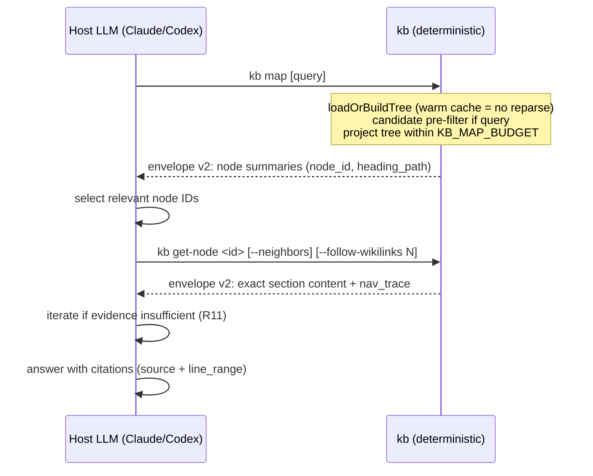

# feat: Budget-bounded LLM tree navigation over the wiki vault

## Summary

Ship PageIndex-style (Karpathy wiki-flat-file) structural retrieval for `kb`: a compact, cached map of `wiki/**` (pages → sections → wikilinks → backlinks) that fits a bounded context-window budget, a `kb map [query]` command that returns node summaries for a host LLM to select from, and a `kb get-node <id>` command that fetches exact sections by stable node ID with neighbor and cross-reference following. The host agent navigates; `kb` core stays deterministic with zero LLM calls.

## Problem Frame

`kb` retrieval today is substring grep over `wiki/**` (`kb recall`). The brainstorm (see origin: `docs/brainstorms/2026-05-08-llm-tree-navigation-and-entire-session-offload-requirements.md`) settles why that loses on technical knowledge: repeated vocabulary, cross-references, and multi-hop context defeat both grep and static vector similarity. The durable shape is structure-aware navigation — the model reasons over a compact tree that fits a context-window budget, selects node IDs, and fetches exact evidence.

A prior plan (`docs/plans/2026-05-08-001-feat-llm-tree-navigation-and-sessions-offload-plan.md`) covered this same direction bundled with a sessions-to-Entire offload. That plan is superseded by this one for the tree-navigation work: its code references drifted (commit `840f49a` removed `withMigrationLock`, added `src/lib/atomic-write.ts`, and grew the session surface), and its sessions-offload phase now conflicts with the most recent shipped work. This plan delivers the retrieval core only, rebased on the current codebase.

## Assumptions

Pipeline-mode scoping decisions, recorded for review rather than confirmed interactively:

- **Sessions offload is out of scope.** The brainstorm marks sessions-to-Entire as settled, but commit `840f49a` (2026-06-11, the newest signal) deliberately invested in the session surface (`kb sessions`, `kb mark-extracted`, `autoExtractNudge`) as an eyes-open stopgap. Deleting that subsystem days later needs an explicit human product decision, not a pipeline inference. Everything session-related is untouched here.
- **No `src/core/` restructure.** The prior plan's package-boundary phase is deferred with the offload; this plan keeps the existing `src/commands/` → `src/lib/` layering.
- **Envelope changes are additive.** The schema version bumps to `"2"` to signal new optional structural fields and a new curation value, but `"session-excerpt"` and the `"sessions"` source scope are retained because their producers remain live.

---

## Requirements

R-IDs reference the origin brainstorm. In scope for this plan:

- R6. `kb` exposes a compact, cached structural map of curated knowledge derived from `wiki/**` frontmatter, titles, aliases, tags, headings, line ranges, wikilinks, backlinks, and content hashes.
- R7. LLM tree navigation is the default smart retrieval flow: model sees the compact map or filtered subtree, selects node IDs, fetches exact evidence, iterates only when evidence is insufficient.
- R8. Adapter-hosted navigation uses deterministic `kb` map/fetch commands; no LLM API key required in `kb` core.
- R9. Before the LLM sees the tree, `kb` reduces the candidate space with cheap local signals (title/alias/tag/heading/wikilink-neighborhood/backlink/lexical).
- R10. Retrieval fetches natural document units (pages, headings, sections, neighbors), never arbitrary fixed-size chunks.
- R11. Navigation supports cross-reference following without restarting the search.
- R12. Fetched material uses the length-prefixed reference envelope, extended with node IDs, heading metadata, and navigation trace.
- R13. Retrieval is evidence-first: `kb` returns sources and bounded content; answer synthesis belongs to the host agent.
- R14 (partial). `raw/**` ask-gating is preserved unchanged (see Unchanged invariants). The clause removing `sessions/**` from the trust model is deferred with the sessions-to-Entire offload decision (see Deferred to Follow-Up Work).
- R15. Access logging stays minimized: hashed queries, counts, byte sizes — never plaintext queries.
- R16. SessionStart/PostCompact stay LLM-free and pointer-only in lazy mode; only static header text changes.
- R17. Map generation is cached and incrementally invalidated from content hashes so repeat navigation does not reparse an unchanged vault.
- R18. LLM navigation prompt size is bounded. If the full map exceeds the budget, `kb` provides a locally filtered subtree or degraded summary before model selection.
- R19. No vector database required. Optional `qmd` may contribute candidate hints; the authoritative path is the structural map plus exact fetch.
- R20. Exact-title and exact-alias requests have a zero-LLM fast path.

Out of scope from the origin: R1–R5, R14's sessions-removal clause, and R21–R24 (repositioning, sessions offload, adapter protocol doc, package split) — see Scope Boundaries.

---

## Scope Boundaries

- Not removing or modifying the session subsystem (`capture-session`, `summarize`, `sessions`, `mark-extracted`, the Stop hook, `autoExtractNudge`). It coexists with tree navigation.
- Not making vector search the default; `qmd` remains an optional hint.
- Not adding a standalone `kb chat`/`kb answer` synthesis command — adapter-hosted navigation only.
- Not restructuring into `src/core/` + `src/adapters/`.
- Not adding PDF/OCR ingestion; this works over the existing markdown vault.
- Not cloning OpenKB's ingestion/watch/chat lifecycle.

### Deferred to Follow-Up Work

- **Sessions-to-Entire offload + agent-neutral repositioning** (origin R1–R5, R14's sessions-removal clause, R21–R22) — requires a human decision reconciling the brainstorm direction with commit `840f49a`'s session investment. The prior plan's Phase A inventory is a starting point but must be re-expanded with the `840f49a` surfaces.
- **`docs/adapter-protocol.md` and per-host adapter packages** (origin R23–R24) — after the retrieval protocol is proven in this slice.
- **Richer `qmd` ranking integration** — this slice wires hints at most.
- **Doctor sweep for stale `.kb/index/` tmp litter** — noted residual finding `docs/residual-review-findings/fix-align-docs-code-drift.md` (P3); worth bundling into a doctor pass if it lands during this work, otherwise follow-up.

---

## Key Technical Decisions

- **Envelope `schema_version` bumps to `"2"`, additively.** New optional chunk fields (`node_id`, `heading_path`, `node_kind`) and a new `Curation` value (`"heading-section"`) cross the validator's closed unions, so a version bump is the honest signal. Unlike the prior plan, `"session-excerpt"` and `source_scope: "sessions"` are **retained** — their producers (`read-session`, `summarize`) remain live. `tests/envelope.test.ts` updates in lockstep.
- **Node ID scheme: `<rel-path>` for pages, `<rel-path>#<heading-slug>` for sections.** GitHub-style slugs (lowercase, dashes, ASCII alphanumerics); collisions within a page disambiguate by ordinal suffix (`#setup-2`). Readable and debuggable; hash-only IDs rejected as opaque. Matches the `[[file#Heading]]` wikilink convention already documented in `templates/KB.md`.
- **One graph, projected per query.** A single cached structure (`pages → sections → wikilinks → backlinks`); `kb map` projects a tree or filtered subtree for the LLM prompt. Avoids maintaining multiple tree shapes while keeping the prompt bounded.
- **Cache at `.kb/index/tree.json`, keyed by content hash.** Each page entry records its `content_hash` (via existing `sha256File`); rebuild reparses only changed/new/removed pages. Writes use the existing `writeTextAtomic` helper plus `withExclusiveLock` on `.kb/index/tree.lock`. This is the proven recipe from the session-capture-manifest refactor: hash recorded inside the artifact, mismatch regenerates, temp-then-rename, O_EXCL lockfile (never flock — unavailable in Bun/macOS).
- **Budget enforced `kb`-side with reserve-then-fit composition.** `KB_MAP_BUDGET` env var (default 16 KiB) bounds `kb map` output, following the repo's established budget precedent (`POINTER_BUDGET` reserve-then-fit, `KB_BUDGET` eager default calibrated after the 20KB-index.md incident). Over-budget full-tree requests degrade to page-titles-only plus a suggestion to query.
- **Host model navigates; `kb` ships only deterministic commands.** `map` / `get-node` / existing `recall`. No LLM key in core (R8).
- **Safe-read primitives extracted, not duplicated.** `walkWiki` and `readWikiFileNoFollow` are currently private to `src/commands/recall.ts`. They move to a shared `src/lib/wiki-read.ts` so the map builder and `get-node` inherit the TOCTOU-hardened pattern (`O_NOFOLLOW`, realpath containment, `MAX_FILE_BYTES` cap) instead of the weaker `get.ts` pattern.
- **`qmd` stays optional via the existing `isQmdOnPath` gateway.** Absence disables nothing; errors fall back silently.
- **Doc + code + contract-test lockstep.** Every unit touching pinned doc strings updates `tests/docs-contract.test.ts` / `tests/skill-contract.test.ts` in the same commit, per the repo's established drift-is-a-bug posture.

---

## High-Level Technical Design

> Directional guidance for review, not implementation specification.

### Navigation flow (adapter mode)



### Tree cache shape (sketch)

```text
TreeCache {
  schema_version: "1"          # cache file schema, distinct from envelope
  built_at:       ISO8601
  pages: [
    {
      id:           "wiki/foo.md"
      title:        "Foo"           # frontmatter.title || first H1 || filename
      type:         string?         # frontmatter.type
      tags:         [string]
      aliases:      [string]
      content_hash: "sha256:..."
      size:         number          # with mtime_ms: stat fast path for warm loads
      mtime_ms:     number
      sections: [
        { id: "wiki/foo.md#installation", heading: "Installation", level: 2,
          line_range: [10, 42], wikilinks: [pageId], children: [Section...] }
      ]
      backlinks: [pageId]
    }
  ]
  by_alias: { [alias]: pageId }     # exact-alias fast path (R20)
  by_tag:   { [tag]:   [pageId] }
}
```

### Node ID grammar

```text
NodeID      ::= PagePart ('#' SectionPart)?
PagePart    ::= relative path under wiki/, e.g. "wiki/foo.md"
SectionPart ::= heading-slug (kebab-case ASCII alnum) ('-' ordinal)?
```

### Envelope v2 (additive)

```text
EnvelopeChunk += node_id?: string            # tree-nav results only
                 heading_path?: [string]     # e.g. ["Foo", "Installation"]
                 node_kind?: "page" | "section"
Curation     += "heading-section"            # session-excerpt RETAINED
EnvelopePolicy (open dict) gains documented keys:
                 tree_root?: string          # on kb map
                 nav_trace?: [string]        # nodes visited for this evidence
```

---

## Implementation Units

Dependency order: U1 → U2 → U3 → U4; U5 anytime before U7; U6 after U3; U7 after U4+U5+U6; U8 after U4+U5; U9 last.

### U1. Extract shared safe vault-walk lib

**Goal:** Move the TOCTOU-hardened walk/read primitives out of `recall.ts` into a shared lib so the map builder and `get-node` reuse them. No behavior change.

**Requirements:** R6, R10 (foundation).

**Dependencies:** None.

**Files:**
- Create: `src/lib/wiki-read.ts` (move `walkWiki`, `readWikiFileNoFollow`, `MAX_FILE_BYTES` from `src/commands/recall.ts`)
- Modify: `src/commands/recall.ts` (import from the new lib; behavior identical)
- Create: `tests/wiki-read.test.ts`

**Approach:** Pure move-and-export. Keep signatures; `recall.ts` keeps its private `MAX_MATCHES`/`CONTEXT_LINES`. Preserve the exact safety semantics: dotfile skip, `lstatSync` symlink rejection, `realpathSync` + `isWithin` containment, `O_RDONLY | O_NOFOLLOW` open, `fstatSync(fd).isFile()`, 256 KiB cap.

**Patterns to follow:** `src/commands/recall.ts:18-92` (current implementation), `src/lib/path-safety.ts` exports.

**Test scenarios:**
- Happy path: walking a fixture wiki returns only `.md` files, recursing subdirectories.
- Edge: symlinked file inside `wiki/` is excluded; symlinked directory is excluded.
- Edge: dotfiles and dot-directories are skipped.
- Edge: file over `MAX_FILE_BYTES` — `readWikiFileNoFollow` refuses/clamps per current behavior (pin whichever recall.ts does today).
- Regression: existing `tests/recall.test.ts` passes unchanged.

**Verification:** `bun run lint && bun test` green with no recall behavior diffs.

---

### U2. Markdown structure parser

**Goal:** Pure functions extracting headings, nested sections with line ranges, and wikilinks from a markdown body. No external AST dependency.

**Requirements:** R6 (inputs), R10 (section boundaries), R11 (wikilink discovery).

**Dependencies:** None (lands alongside U1).

**Files:**
- Create: `src/lib/markdown.ts`
- Create: `src/lib/map/types.ts` (parsed-structure types; extended in U3)
- Create: `tests/markdown.test.ts`

**Approach:**
- API (directional): `parseHeadings(body)`, `parseSections(body)` (nested by level, 1-indexed inclusive line ranges; section spans heading line to line before next same-or-shallower heading), `parseWikilinks(body)`, `slugify(heading)`.
- Heading regex mirrors the existing `HEADING_RE` shape in `src/lib/inject/pointer.ts:6`, generalized to `#{1,6}`.
- Wikilink grammar must cover the conventions documented in `templates/KB.md`: `[[kebab-filename|Display]]`, `[[file#Heading|Title]]`, `[[file#^block-id|Title]]`, path-style `[[raw/foo.md]]`. Capture `{ target, heading?, blockRef?, display?, line }`; targets captured verbatim (resolution and rejection are the builder's job).
- Slug rule: lowercase, whitespace → `-`, strip non `[a-z0-9-]`, collapse repeats. ASCII-only; duplicate headings return identical slugs — ordinal disambiguation is the caller's (U3) responsibility.
- Pure functions, no I/O.

**Execution note:** Test-first.

**Patterns to follow:** `src/lib/frontmatter.ts` (small, pure, no deps); `src/lib/inject/pointer.ts:6` heading regex.

**Test scenarios:**
- Happy: H1/H2/H2/H3 body → 4 headings, correct levels and lines; nesting puts both H3s under the right H2; last section's range ends at EOF.
- Edge: body starting at H3 (no H1/H2) — top-level sections start at H3.
- Edge: empty body → empty arrays.
- Edge: heading with markdown formatting (`## **Bold**`) → slug `bold`.
- Edge: ATX headings inside fenced code blocks are picked up in v1 — documented known limitation, pinned in a test.
- Wikilinks: `[[foo]]` → target `foo`; `[[foo|Foo Display]]` → display captured; `[[file#Heading|T]]` → heading captured; `[[file#^block1]]` → blockRef captured; `[[raw/foo.md]]` → path-style target.
- Wikilink edge: `[[../etc/passwd]]` captured verbatim (parser does not resolve).
- Slug collision: two `## Setup` headings → identical slugs returned.

**Verification:** `tests/markdown.test.ts` passes; `bun run lint` clean.

---

### U3. Map builder + node ID scheme

**Goal:** Walk `wiki/**`, parse frontmatter + structure, produce the in-memory `TreeCache` graph: pages, nested sections with IDs, resolved wikilinks, computed backlinks, alias/tag indexes.

**Requirements:** R6, R20 (foothold via `by_alias`).

**Dependencies:** U1, U2.

**Files:**
- Create: `src/lib/map/node-id.ts` (slug + ordinal + grammar validation)
- Create: `src/lib/map/builder.ts`
- Modify: `src/lib/map/types.ts` (`TreeCache`, `PageEntry`, `SectionEntry`)
- Create: `tests/map-builder.test.ts`

**Approach:**
- `buildTree(vaultPath)` walks via U1's `walkWiki`, parses frontmatter via `src/lib/frontmatter.ts`, structure via U2, hashes via `src/lib/hash.ts:sha256File`.
- Node IDs per the grammar in the design section; ordinal suffixes only on intra-page slug collisions.
- Wikilink resolution: `[[foo]]` → `wiki/foo.md` if it exists → else `by_alias` lookup → else recorded unresolved with target preserved (the LLM may read intent from it). Targets containing `..` or absolute paths are recorded unresolved, never resolved outside `wiki/`.
- Backlinks computed in a second pass.
- Title priority: `frontmatter.title` → first H1 → filename sans `.md`.
- Deterministic output: pages sorted by path, indexes key-sorted.
- Malformed frontmatter: skip page body parsing, record `{ malformed: true }`, warn to stderr, never throw.

**Execution note:** Test-first.

**Patterns to follow:** U1 walk primitives; `src/lib/frontmatter.ts`; determinism conventions from `tests/envelope.test.ts` roundtrip style.

**Test scenarios:**
- Happy: 3-page fixture with 6 sections, 2 wikilinks → expected node IDs, resolved links, computed backlinks.
- Happy: frontmatter `aliases: [Foo]` → `by_alias["Foo"] === "wiki/foo.md"`; tags populate `by_tag`.
- Edge: no frontmatter → filename title, empty tags/aliases.
- Edge: duplicate `## Setup` headings → `#setup` and `#setup-2`.
- Edge: malformed YAML frontmatter → page recorded malformed; build completes.
- Edge: symlink in `wiki/` excluded (inherited from U1).
- Edge: oversized file → recorded with no sections, warning to stderr.
- Edge: empty `wiki/` → `pages: []`, empty indexes.
- Edge: `[[../escape]]` and `[[/abs/path]]` recorded unresolved.
- Backlinks: A links B → B.backlinks includes A.
- Determinism: same vault built twice → JSON-equal output.

**Verification:** `tests/map-builder.test.ts` passes.

---

### U4. Tree cache with hash invalidation

**Goal:** Persist `TreeCache` at `<vault>/.kb/index/tree.json`; incremental rebuild from content hashes; atomic, lock-coordinated writes.

**Requirements:** R17.

**Dependencies:** U3.

**Files:**
- Create: `src/lib/map/cache.ts`
- Create: `tests/map-cache.test.ts`

**Approach:**
- API (directional): `loadOrBuildTree(vaultPath)`, `invalidateTree(vaultPath)`.
- Load existing `tree.json` if present. Freshness check: record `size` and `mtime_ms` per page alongside `content_hash`; warm load stats each file and re-hashes only entries whose size/mtime differ (the hash remains the authority for reparse decisions). Reparse only changed pages; detect added/removed pages; recompute backlinks and indexes after any change. Warm loads are O(pages) stats + O(changed) hashing/reparse.
- Writes: `writeTextAtomic` from `src/lib/atomic-write.ts` (already handles temp-then-rename + EXDEV fallback) under `withExclusiveLock("<vault>/.kb/index/tree.lock")` from `src/lib/lockfile.ts`. Note: `withMigrationLock` no longer exists — do not reference it.
- Before any write, validate the index dir: `mkdirSync` `<vault>/.kb/index/` if absent, then `assertGenuineScopeDir` against the vault (matching the `recall.ts` pattern for `wiki/`) so a crafted `--vault-path` or symlinked `.kb/index/` cannot redirect cache writes outside the vault.
- Cache file carries its own `schema_version`; unknown version or JSON parse error → full rebuild.
- Rebuild diagnostics to stderr only; no access-log entry for cache internals (access log stays a retrieval record, R15).

**Execution note:** Test-first.

**Patterns to follow:** hash-keyed invalidation recipe proven in `docs/plans/2026-04-19-001-refactor-session-capture-manifest-plan.md` (hash inside artifact, mismatch regenerates); `src/lib/log-writer.ts:40` lock usage; `src/lib/atomic-write.ts`.

**Test scenarios:**
- Happy (cold): no cache → builds, writes, returns.
- Happy (warm): all size/mtime stats match → returned without re-hashing or reparsing; `tree.json` mtime unchanged.
- Happy (one edit): stat differs → page re-hashed and reparsed; unchanged pages untouched; backlinks recomputed.
- Edge: mtime/size unchanged but content differs (e.g., crafted same-size touch-back edit) → stat fast path misses it by design; document the limitation; `invalidateTree` is the manual escape hatch.
- Edge: page deleted → removed from cache, dangling backlinks cleared.
- Edge: page added → parsed in.
- Edge: corrupted JSON → full rebuild.
- Edge: unknown cache `schema_version` → full rebuild.
- Concurrency: two processes call `loadOrBuildTree` on a cold cache → both return correct trees; `tree.json` never half-written.
- Concurrency: lock held past retry budget → `LockBusyError` surfaces.
- Atomicity: simulated crash mid-write (tmp file present) → next load ignores tmp, `tree.json` absent-or-valid.

**Verification:** `tests/map-cache.test.ts` passes; manual smoke — edit one page, observe single-page reparse.

---

### U5. Envelope v2 — additive structural extension

**Goal:** Bump `schema_version` to `"2"`; add optional chunk fields `node_id`, `heading_path`, `node_kind`; add `Curation` value `"heading-section"`; document policy keys `tree_root`, `nav_trace`. Retain `"session-excerpt"` and `source_scope: "sessions"`.

**Requirements:** R12.

**Dependencies:** None (lands any time before U7/U8).

**Files:**
- Modify: `src/lib/envelope.ts`
- Modify: `tests/envelope.test.ts`
- Modify: `tests/list-topics.test.ts` (change `expect(env.schema_version).toBe("1")` to `toBe("2")`)

**Approach:**
- `Curation` becomes `"curated" | "raw-excerpt" | "session-excerpt" | "heading-section"`.
- Optional chunk fields validated when present (`node_id` string, `heading_path` string array, `node_kind` in `{"page","section"}`); absent fields remain valid so existing producers (`recall`, `get`, `read-session`, `sensitive-read`) are untouched beyond emitting `"2"`.
- Policy is already an open dict; `tree_root`/`nav_trace` are documented types only.
- `buildEnvelope` emits `"2"`; `parseEnvelope` accepts only `"2"` (`EnvelopeVersionError` otherwise — envelopes are stdout-only, never persisted, so no back-compat read needed).

**Execution note:** Test-first — update `tests/envelope.test.ts` to the v2 contract, watch it fail, then change `envelope.ts`.

**Patterns to follow:** existing `assertValidShape` hand-rolled validation style.

**Test scenarios:**
- Happy: v2 roundtrip; chunks with and without the optional fields; `curation: "heading-section"` accepted; `curation: "session-excerpt"` still accepted.
- Edge: `node_id` wrong type → rejected; `node_kind: "blob"` → rejected; `heading_path` containing non-strings → rejected.
- Error: `schema_version: "1"` and `"3"` → `EnvelopeVersionError`.
- Integration: `bun src/cli.ts recall <q>` and `read-session` outputs parse under the v2 validator.

**Verification:** `bun test tests/envelope.test.ts` passes; full suite green (all envelope-parsing tests see `"2"`).

---

### U6. Candidate generation pre-filter

**Goal:** Cheap deterministic pre-filter reducing the LLM's candidate space for `kb map <query>`. Priority: exact title → exact alias → tag → heading substring → wikilink neighborhood → backlinks → lexical body fallback. Optional `qmd` hints.

**Requirements:** R9, R19, R20.

**Dependencies:** U3.

**Files:**
- Create: `src/lib/map/candidates.ts`
- Create: `tests/candidates.test.ts`

**Approach:**
- API (directional): `selectCandidates(tree, query, limit)` returning bucketed node IDs (`exact`, `tagged`, `heading`, `neighborhood`, `backlink`, `lexical`, `qmd?`), each deduped; caller controls ordering.
- Exact title/alias is case-insensitive and constitutes the R20 zero-LLM fast path.
- Lexical fallback reads bodies via U1 primitives only when earlier buckets are thin.
- `qmd`: gate on existing `isQmdOnPath()` from `src/lib/qmd.ts` (note: not `isQmdAvailable`); failures fall back silently; results land in their own bucket, never re-ranked.
- Total cap default 30; buckets fill in priority order. Weighting/tie-breaking tunable at implementation against the success-criteria query.

**Execution note:** Test-first.

**Patterns to follow:** `src/lib/qmd.ts` narrow-gateway boundary; substring scan shape from `recall.ts`.

**Test scenarios:**
- Happy per bucket: exact title first; exact alias first; tag match; heading substring → section node ID; neighborhood (A matches, A→B,C linked); backlinks (B,C → A); lexical-only body match lands only in lexical bucket.
- Edge: no matches → all buckets empty.
- Edge: 100 matches, limit 30 → exactly 30, priority-ordered.
- `qmd` present (stubbed) → its IDs in the `qmd` bucket; absent → identical behavior, no error; erroring → silent fallback.
- Determinism: same query, same tree → same result.

**Verification:** `tests/candidates.test.ts` passes.

---

### U7. `kb map` command

**Goal:** Ship `kb map [query] [--budget <bytes>] [--vault-path|-p]`. No query: compact projection of the whole tree as node-summary chunks. With query: U6-filtered subtree. Output bounded by `KB_MAP_BUDGET`.

**Requirements:** R6, R7, R8, R13, R15, R18.

**Dependencies:** U4, U5, U6.

**Files:**
- Create: `src/commands/map.ts`
- Modify: `src/cli.ts` (register `map`, lazy dynamic import per existing pattern)
- Modify: `src/lib/access-log.ts` (`AccessLogCommand` union += `"map"`)
- Create: `tests/map-command.test.ts`

**Approach:**
- Chunk per node: `source` = page path, `line_range` = section/page span, `curation: "heading-section"` (sections) or `"curated"` (pages), `text` = `<heading-path>: <≤200-char intro>`, plus `node_id`, `heading_path`, `node_kind`.
- Budget: `--budget` flag > `KB_MAP_BUDGET` env > 16 KiB default (env-var naming per the existing `KB_*` table; README env table updated in U9). Parse the env var defensively: non-numeric, zero, or negative values fall back to the default (a degenerate budget must not silently bypass R18).
- Fitting follows the repo's reserve-then-fit precedent with three degradation tiers: (1) full page+section chunks; (2) page-level chunks only (sections elided, `node_kind: "page"`); (3) page-titles-only plus `policy.suggestions: ["Try: kb map <query>", ...]`. Per-node envelope overhead is real (~300–500 bytes/node with JSON keys and metadata), so calibrate tier thresholds against the ~200-page fixture from U4 — R18 is the load-bearing requirement and the projection, not just the cache build, must be sized.
- Policy: `trust: "curated"`, `source_scope: "wiki"`, `tree_root: "wiki/"`.
- Access log: `command: "map"`, hashed query (empty-string hash when no query), `pages_returned`, `bytes_returned` — plaintext never (R15).
- Errors to stderr + exit 1; stdout reserved for the envelope (repo convention).
- First action is `loadOrBuildTree` — cheap when warm.

**Execution note:** Test-first.

**Patterns to follow:** `src/commands/recall.ts` (envelope build + `appendAccessLog` + `--vault-path`/`-p` + `resolveVaultPath` fallback); `src/commands/list-topics.ts` chunk emission.

**Test scenarios:**
- Happy (no query): small vault → page+section chunks, every chunk has `node_id`/`heading_path`, `policy.tree_root === "wiki/"`.
- Happy (query): "auth" against a vault with `wiki/auth.md` → auth cluster first.
- Happy (exact alias): aliased query → that page first (R20).
- Edge (zero results): `no_results: true`, empty chunks, lexical-fallback suggestion.
- Edge (budget overflow, no query): degrades tier-by-tier (sections elided first, then titles-only + suggestions); output bytes ≤ budget.
- Sizing: a ~50-page/150-section fixture returns a non-degraded or page-level (tier 1–2) map within the 16 KiB default — pins the per-node byte cost.
- Edge (`--budget 1024` flag overrides env): respected.
- Edge (`KB_MAP_BUDGET=0` and `KB_MAP_BUDGET=notanumber`): both fall back to the 16 KiB default.
- Edge (empty wiki): `no_results: true`.
- Logging: exactly one access-log line per invocation; query hashed.
- Integration: second consecutive call does not rewrite `tree.json` (warm cache); output parses under the v2 validator.

**Verification:** `bun test tests/map-command.test.ts` passes; manual smoke — `kb map "PageIndex"` against a fixture vault containing the brainstorm's success-criteria pages surfaces the PageIndex/vector-RAG/technical-manuals cluster.

---

### U8. `kb get-node <id>` command

**Goal:** Fetch exact section or page content by node ID, with `--neighbors` (same-level siblings) and `--follow-wikilinks <max>` (bounded cross-reference previews). Multi-hop navigation without restarting the search.

**Requirements:** R10, R11, R12, R13, R15.

**Dependencies:** U4, U5.

**Files:**
- Create: `src/commands/get-node.ts`
- Modify: `src/cli.ts` (register `get-node`)
- Modify: `src/lib/access-log.ts` (union += `"get-node"`)
- Create: `tests/get-node.test.ts`

**Approach:**
- Resolve `<id>` against the cache. Page ID → whole page, `curation: "curated"`. Section ID → that section's `line_range`, `curation: "heading-section"`.
- `--neighbors`: previous and next sibling sections at the same level as extra chunks.
- `--follow-wikilinks N` (default 0, cap 5): first ~200 bytes of each wikilinked page from the requested section, each with its own `node_id`; unresolved links silently skipped.
- ID validation before any cache lookup or read: run the PagePart through `assertSafeFilename`-equivalent checks from `src/lib/path-safety.ts` (reject absolute paths, `..` segments, null bytes, `\` separators), then verify `isWithin(resolve(vaultPath, pagePart), wikiReal)`. IDs failing the grammar exit 1 before any file read.
- `--follow-wikilinks` resolves only IDs present as **resolved** entries in the cache (builder output); unresolved wikilink targets are never converted to file paths.
- Policy: `trust: "curated"`, `source_scope: "wiki"`, `nav_trace: [requested-id, ...followed]`. Sanitization boundary: `nav_trace` entries are restricted to IDs that passed `node-id.ts` grammar validation — wikilink-derived strings that don't conform are skipped from `nav_trace` entirely, never echoed verbatim (vault content is untrusted).
- Unknown ID: stale-cache rebuild attempt once (meaningful under the U4 stat fast path — it catches edits landing between command start and ID resolution), then stderr error + exit 1, no envelope (matches `get.ts` error posture).
- Access log: `command: "get-node"`, query-hash of the ID.

**Execution note:** Test-first.

**Patterns to follow:** `src/commands/get.ts` (page fetch shape) but with U1's hardened reads; `recall.ts` for logging.

**Test scenarios:**
- Happy: page ID → full file, one chunk; section ID → exact `line_range` only.
- Happy: `--neighbors` → prev+next sibling chunks at same level; sole section → main chunk only.
- Happy: `--follow-wikilinks 2` with `[[bar]]`, `[[baz]]` → 1 main + 2 preview chunks; `nav_trace` ordered.
- Edge: deep nesting — H4 section ID resolves the H4 range, not the parent's.
- Edge: follow to unresolved wikilink → skipped, absent from `nav_trace`.
- Edge: wikilink cycle (foo↔bar) with cap → no infinite expansion.
- Error: unknown ID → exit 1, stderr, empty stdout.
- Error: `wiki/../etc/passwd` → exit 1 before any file read.
- Error: ID in cache but file deleted on disk → one rebuild attempt, then error.
- Logging: one hashed access-log line.
- Integration: output parses under v2 validator with `node_id`/`heading_path`/`node_kind` present.

**Verification:** `bun test tests/get-node.test.ts` passes; manual smoke — `kb map "PageIndex"` → pick an ID → `kb get-node <id> --neighbors --follow-wikilinks 1`.

---

### U9. Docs surface + pointer header

**Goal:** Teach the map→select→fetch loop as the default smart retrieval in all doc surfaces; keep `kb recall` as the lexical fallback; update the lazy pointer header to mention `kb map`. Session documentation is untouched.

**Requirements:** R7 (default flow), R16 (pointer stays static text), R18 (budget documented).

**Dependencies:** U7, U8.

**Files:**
- Modify: `templates/KB.md` (Query workflow section: map→get-node first, recall as fallback; envelope v2 note; `KB_MAP_BUDGET`)
- Modify: `skills/kb/SKILL.md` (command table rows for `map`/`get-node`; query workflow rewrite)
- Modify: `commands/query.md` (same loop)
- Modify: `README.md` (CLI reference table rows; env var table row for `KB_MAP_BUDGET`)
- Modify: `src/lib/inject/pointer.ts` (header text only)
- Modify: `tests/inject-modes.test.ts` (pin new header; budget assertions unchanged)
- Modify: `tests/docs-contract.test.ts`, `tests/skill-contract.test.ts` (positive pins for `kb map`, `kb get-node`, `node ID`; existing pins untouched)

**Approach:**
- New pointer header (directional): `## KB Vault` / `Curated memory available. Do not read sessions/ or raw/ directly.` / `Run `kb map <query>` to find knowledge; `kb recall <query>` only as plain-text fallback.` — `map` is the verb for finding knowledge and `recall` is explicitly the fallback (the pointer is the highest-frequency steering surface; parallel "structure vs search" framing would route search-shaped questions to `recall` and defeat R7 on launch). Keeps the sessions/raw warning (the trust model is unchanged), stays within `POINTER_BUDGET = 500` including the `autoExtractNudge` reserve, and preserves the topic-shrinking fit loop untouched (R16: text-only change). Pin the fallback framing in the U9 inject-modes test.
- Docs changes are additive: new rows/sections; existing pinned strings (`kb recall`, `kb read-session`, extract-flow wording) are not reworded.
- Contract tests update in the same commit as their docs (lockstep convention).

**Execution note:** Update contract tests first, then make docs match.

**Patterns to follow:** existing README table/env-table formats; `tests/docs-contract.test.ts` containment-assertion style.

**Test scenarios:**
- `tests/docs-contract.test.ts`: KB.md and SKILL.md contain `kb map` and `kb get-node`; all pre-existing pins still pass.
- `tests/inject-modes.test.ts`: pointer contains `kb map`; byte length ≤ 500 with nudge active and topics present; eager mode unaffected.
- Cross-surface: README CLI table lists both commands; env table lists `KB_MAP_BUDGET` with default.

**Verification:** full `bun test` green; manual read-through of the query workflow in `templates/KB.md` walks the loop coherently.

---

## System-Wide Impact

- **Hooks unchanged in shape:** SessionStart/PostCompact still run pointer-only, LLM-free; only the static header string changes (U9). The Stop hook and `autoExtractNudge` are untouched.
- **New entry points:** `kb map`, `kb get-node`; both trigger implicit warm-cache `loadOrBuildTree`.
- **Error propagation:** per-file parse errors degrade (skip + stderr), never fail the command; lock contention surfaces as `LockBusyError` after retry budget; unknown node IDs exit 1 with stderr only.
- **Envelope v2 is a breaking parse change** for any external consumer pinning `"1"`; in-tree consumers are tests, updated in lockstep. Stdout-only, never persisted — clean-break posture is established repo precedent.
- **Unchanged invariants:** length-prefixed wire framing; `raw/**` ask-gating; hashed-query access logging; `path-safety.ts` primitives (now shared via U1 rather than copied); session subsystem byte-identical.

---

## Risks & Dependencies

| Risk | Mitigation |
|------|------------|
| Envelope v2 breaks unknown external consumers | Stdout-only, never persisted; clean-break posture per repo precedent; release note pins `schema_version: "2"`. |
| Tree cache slow on very large vaults | Stat-based fast path makes warm loads O(pages) stats + O(changed) hashing/reparse; calibrate against a ~200-page fixture in U4; lazy partial-load deferred until proven needed. |
| Heading-slug instability across edits | Ordinal rule deterministic and pinned in tests; IDs are promised stable across rebuilds of identical content, not across content edits. |
| `.kb/index/` tmp litter on crash (known `writeTextAtomic` residual, P3) | Low frequency; doctor sweep listed in Deferred follow-ups; tmp files are ignored by the loader. |
| Pointer header + nudge overflow 500 bytes | U9 test asserts byte length with nudge active; topic-shrink loop already handles pressure. |
| `qmd` integration flakes tests | Stub by default; real-binary-or-skip pattern already established in repo. |
| Docs drift from new command behavior | Contract tests pin the new strings in the same commits (lockstep convention). |
| Concurrent map writes corrupt cache | `writeTextAtomic` + `withExclusiveLock`; concurrency tests in U4 pin the contract. |

---

## Sources & Research

- Origin: [docs/brainstorms/2026-05-08-llm-tree-navigation-and-entire-session-offload-requirements.md](../brainstorms/2026-05-08-llm-tree-navigation-and-entire-session-offload-requirements.md)
- Superseded prior plan (tree-nav portion): [docs/plans/2026-05-08-001-feat-llm-tree-navigation-and-sessions-offload-plan.md](2026-05-08-001-feat-llm-tree-navigation-and-sessions-offload-plan.md)
- Cache recipe: [docs/plans/2026-04-19-001-refactor-session-capture-manifest-plan.md](2026-04-19-001-refactor-session-capture-manifest-plan.md)
- Trust-boundary invariants (shipped): [docs/plans/2026-04-21-001-feat-vault-trust-boundary-lazy-retrieval-plan.md](2026-04-21-001-feat-vault-trust-boundary-lazy-retrieval-plan.md)
- Ceremony sizing: [docs/solutions/workflow-issues/match-review-ceremony-to-codebase-scale-2026-04-25.md](../solutions/workflow-issues/match-review-ceremony-to-codebase-scale-2026-04-25.md)
- Open residuals: [docs/residual-review-findings/fix-align-docs-code-drift.md](../residual-review-findings/fix-align-docs-code-drift.md)
- External (via origin): PageIndex — https://pageindex.ai/research/pageindex-intro ; technical manuals — https://pageindex.ai/blog/technical-manuals ; OpenKB — https://github.com/VectifyAI/OpenKB
- Load-bearing current-code facts verified 2026-06-12: `src/lib/envelope.ts` (v1, closed `Curation`), `src/lib/lockfile.ts` (`withExclusiveLock`/`withLogLock` only), `src/lib/atomic-write.ts` (`writeTextAtomic`), `src/lib/qmd.ts` (`isQmdOnPath`), `src/commands/recall.ts:18-92` (private walk primitives), `src/lib/inject/pointer.ts` (`POINTER_BUDGET = 500`, nudge reserve), `src/lib/access-log.ts` (`AccessLogCommand` union incl. `"sessions"`, `WriteAuditCommand`), `tests/recall.test.ts:16-52` (fixture-vault + spawn conventions).
